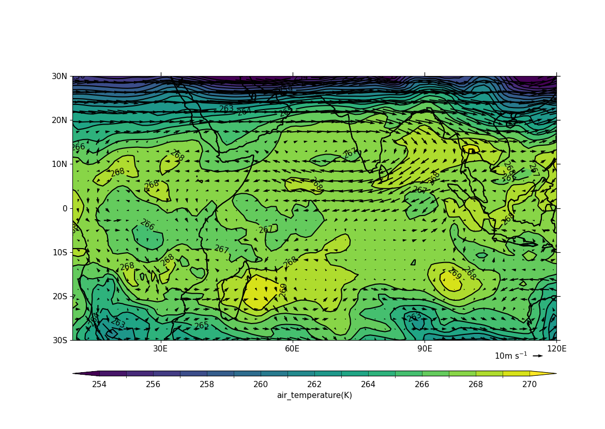

.. _example14:

Example 14: Vector plot overlaid on a contour map
-------------------------------------------------

.. code-block:: python
   :caption: Overlaying a vector plot on a contoured temperature field

   f = cf.read(f"{self.data_dir}/ggap.nc")

   u = f[1].subspace(pressure=500)
   v = f[3].subspace(pressure=500)
   t = f[0].subspace(pressure=500)

   cfp.gopen()
   cfp.mapset(lonmin=10, lonmax=120, latmin=-30, latmax=30)
   cfp.levs(min=254, max=270, step=1)
   cfp.con(t)
   cfp.vect(u=u, v=v, key_length=10, scale=50, stride=2)
   cfp.gclose()

