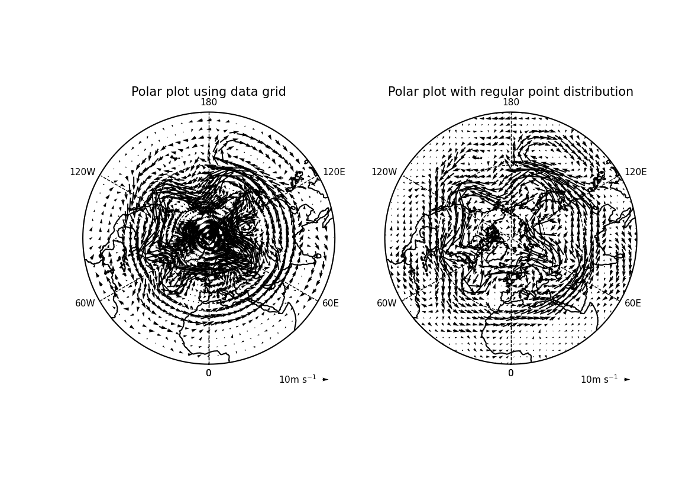

.. _example15:

Example 15
----------

.. code-block:: python
   :caption: *TODO describe Example 15*

   f = cf.read(f"{self.data_dir}/ggap.nc")
   u = f[1]
   v = f[3]
   u = u.subspace(Z=500)
   v = v.subspace(Z=500)

   cfp.mapset(proj="npstere")

   cfp.vect(
       u=u,
       v=v,
       key_length=10,
       scale=100,
       pts=40,
       title="Polar plot with regular point distribution",
   )

