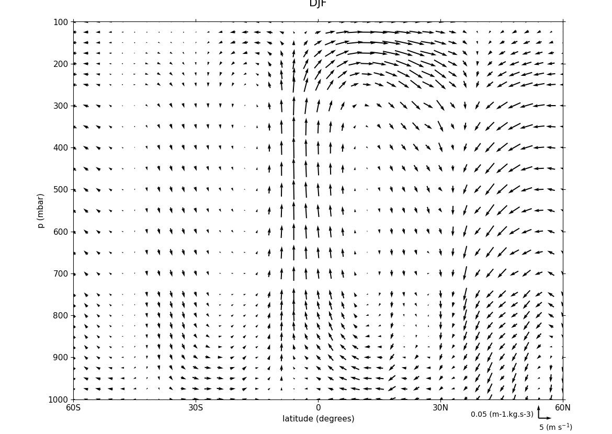

.. _example16a:

Example 16a: Zonal vector plot
------------------------------

.. code-block:: python
   :caption: Vector plot of a zonal mean

   c = cf.read(f"{self.data_dir}/vaAMIPlcd_DJF.nc")[0]
   c = c.subspace(Y=cf.wi(-60, 60))
   c = c.subspace(X=cf.wi(80, 160))
   c = c.collapse("T: mean X: mean")

   g = cf.read(f"{self.data_dir}/wapAMIPlcd_DJF.nc")[0]
   g = g.subspace(Y=cf.wi(-60, 60))
   g = g.subspace(X=cf.wi(80, 160))
   g = g.collapse("T: mean X: mean")

   v = -1 * g

   cfp.vect(
       u=c,
       v=v,
       key_length=[5, 0.05],
       scale=[20, 0.2],
       title="DJF",
       key_location=[0.95, -0.05],
   )

