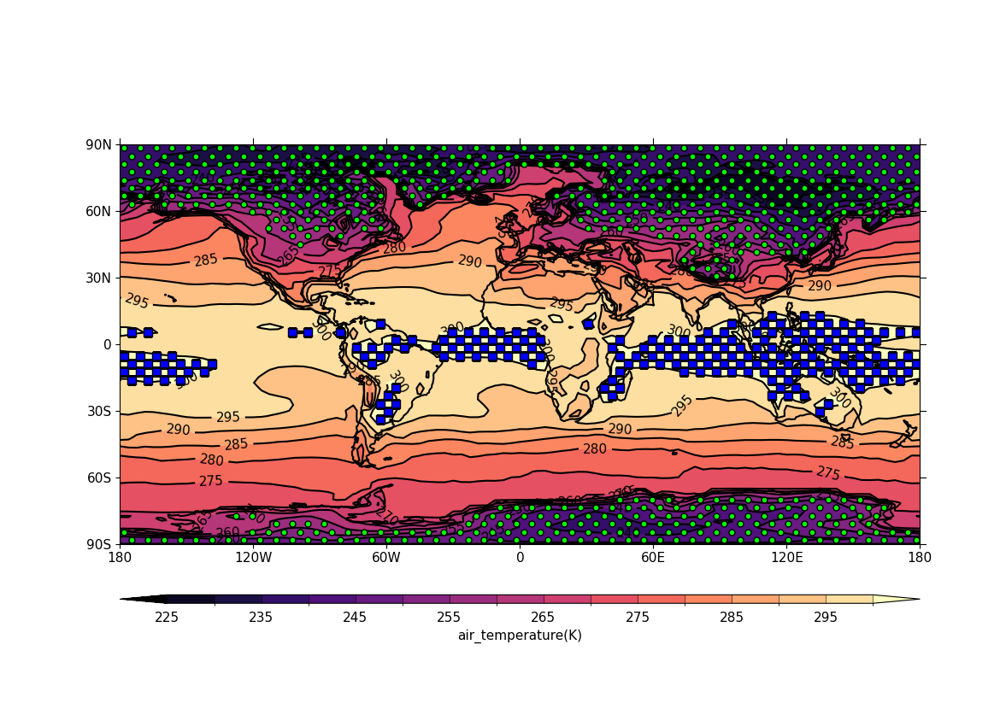

.. _example17:

Example 17: Basic stipple plot
------------------------------

.. code-block:: python
   :caption: A stipple plot, whereby stippling is applied to a contour
             plot to indicate areas of statistical significance.

   f = cf.read(f"{self.data_dir}/tas_A1.nc")[0]

   g = f.subspace(time=15)

   cfp.gopen()
   cfp.cscale("magma")
   cfp.con(g)
   cfp.stipple(f=g, min=220, max=260, size=100, color="#00ff00")
   cfp.stipple(
       f=g, min=300, max=330, size=50, color="#0000ff", marker="s"
   )
   cfp.gclose()

