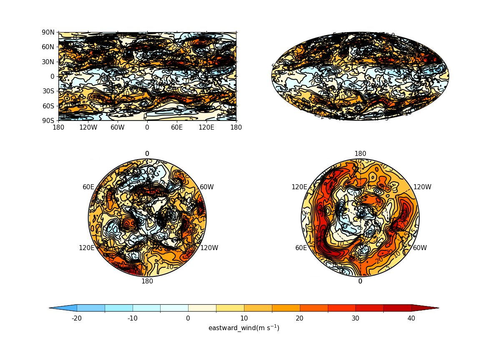

.. _example19a:

Example 19a: Multiple plots
---------------------------

.. code-block:: python
   :caption: Making a single figure with multiple plots on it

   f = cf.read(f"cfplot_data/ggap.nc")[1]
   cfp.gopen(rows=2, columns=2, bottom=0.2)
   cfp.gpos(1)
   cfp.con(f.subspace(pressure=500), colorbar=None)
   cfp.gpos(2)
   cfp.mapset(proj="moll")
   cfp.con(f.subspace(pressure=500), colorbar=None)
   cfp.gpos(3)
   cfp.mapset(proj="npstere", boundinglat=30, lon_0=180)
   cfp.con(f.subspace(pressure=500), colorbar=None)
   cfp.gpos(4)
   cfp.mapset(proj="spstere", boundinglat=-30, lon_0=180)
   cfp.con(
       f.subspace(pressure=500),
       colorbar_position=[0.1, 0.1, 0.8, 0.02],
       colorbar_orientation="horizontal",
   )
   cfp.gclose()

