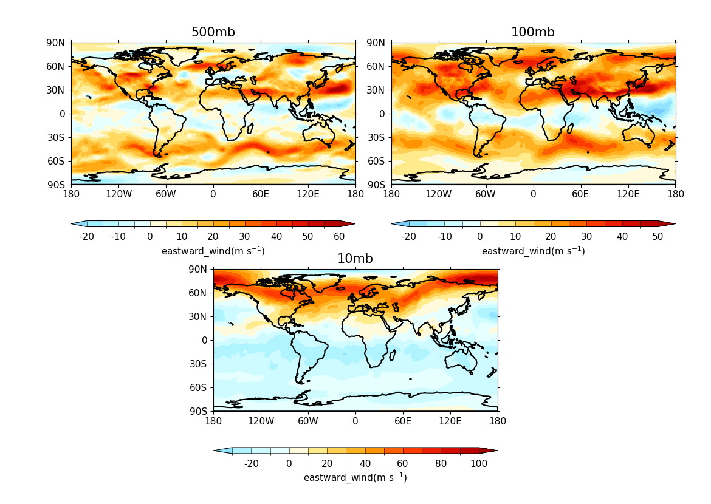

.. _example19b:

Example 19b
***********

.. code-block:: python
   :caption: *TODO describe Example 19b*
   f = cf.read(f"{self.data_dir}/ggap.nc")[1]

   cfp.gopen(user_position=True)

   cfp.gpos(xmin=0.1, xmax=0.5, ymin=0.55, ymax=1.0)
   cfp.con(f.subspace(Z=500), title="500mb", lines=False)

   cfp.gpos(xmin=0.55, xmax=0.95, ymin=0.55, ymax=1.0)
   cfp.con(f.subspace(Z=100), title="100mb", lines=False)

   cfp.gpos(xmin=0.3, xmax=0.7, ymin=0.1, ymax=0.55)
   cfp.con(f.subspace(Z=10), title="10mb", lines=False)

   cfp.gclose()

