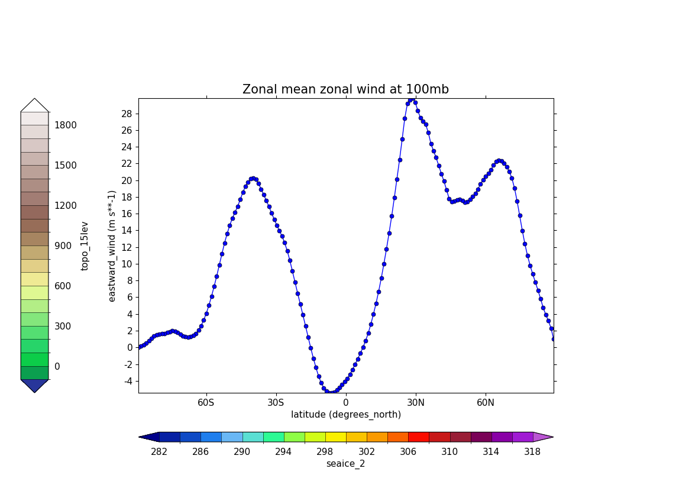

.. _example19c:

Example 19c: Accomodating more than one colour bar
--------------------------------------------------

.. code-block:: python
   :caption: Using the approach to make a single figure with multiple plots
             on it to fit an extra colour bar

   f = cf.read(f"{self.data_dir}/ggap.nc")[1]
   g = f.collapse("X: mean")

   cfp.gopen(user_position=True)

   cfp.gpos(xmin=0.2, ymin=0.2, xmax=0.8, ymax=0.8)
   cfp.lineplot(
       g.subspace(pressure=100),
       marker="o",
       color="blue",
       title="Zonal mean zonal wind at 100mb",
   )

   cfp.cscale("seaice_2", ncols=20)
   levs = np.arange(282, 320, 2)
   cfp.cbar(levs=levs, position=[0.2, 0.1, 0.6, 0.02], title="seaice_2")

   cfp.cscale("topo_15lev", ncols=22)
   levs = np.arange(-100, 2000, 100)
   cfp.cbar(
       levs=levs,
       position=[0.03, 0.2, 0.04, 0.6],
       orientation="vertical",
       title="topo_15lev",
   )

   cfp.gclose()

