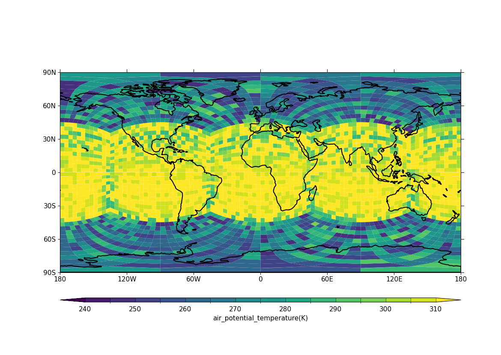

.. _example24a:

Example 24a: UGRID blockfill plot with LFRic cubed sphere mesh output
---------------------------------------------------------------------

.. code-block:: python
   :caption: Making a blockfill plot of UGRID data, specifically LFRic
             model output which is defined on a cubed sphere mesh

   f = cf.read("cfplot_data/lfric_initial.nc")

   # Select the relevant fields for the objects required for the plot,
   # taking the air potential temperature as a variable to choose to view.
   pot = f.select_by_identity("air_potential_temperature")[0]
   lats = f.select_by_identity("latitude")[0]
   lons = f.select_by_identity("longitude")[0]
   faces = f.select_by_identity("cf_role=face_edge_connectivity")[0]

   # Reduce the variable to match the shapes
   pot = pot[4,:]

   cfp.levs(240, 310, 5)

   cfp.con(
       f=pot, face_lons=lons, face_lats=lats,
       face_connectivity=faces, lines=False, blockfill=True,
   )

