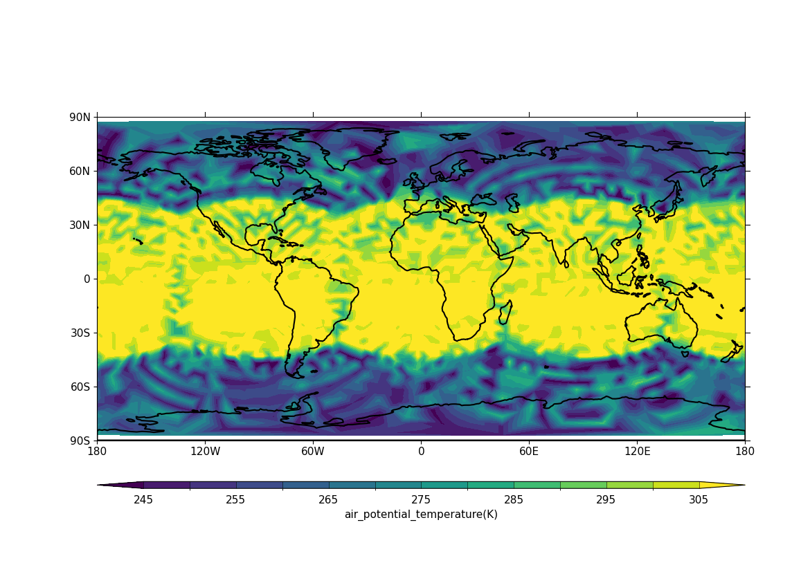

.. _example24c:

Example 24c: UGRID contour plot with LFRic cubed sphere mesh output
-------------------------------------------------------------------

.. code-block:: python
   :caption: Making a contour plot of UGRID data, specifically LFRic
             model output which is defined on a cubed sphere mesh (see
             Example 24a for a more effective plot form for this,
             blockfill)

   f = cf.read("cfplot_data/lfric_initial.nc")
   pot = f.select_by_identity("air_potential_temperature")[0]

   g = pot[0, :]
   cfp.con(g, lines=False)

