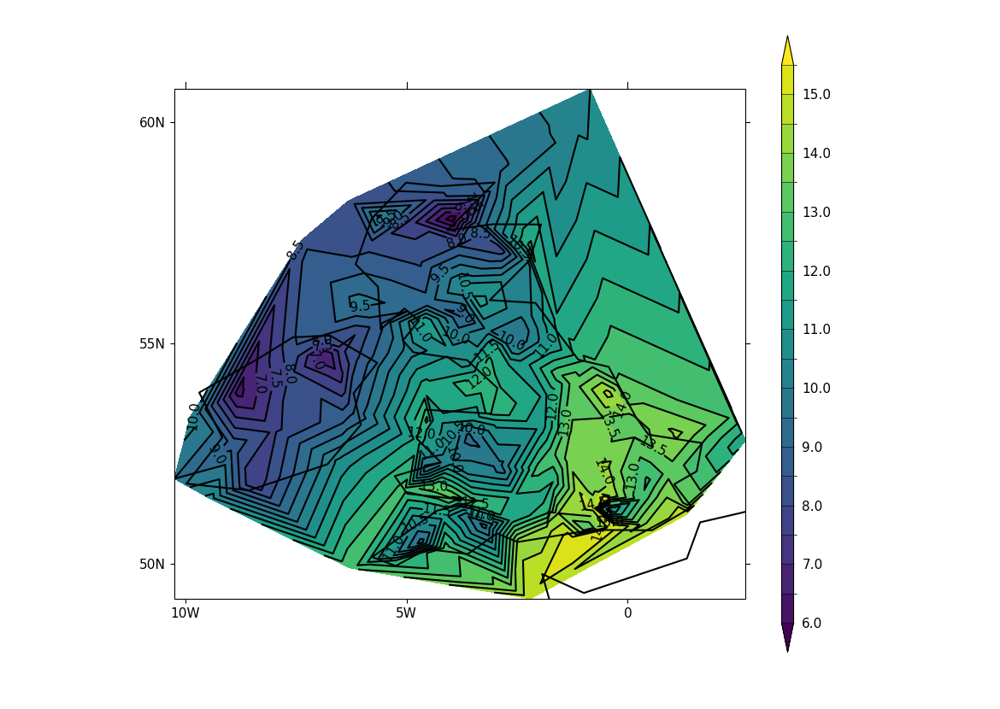

.. _example26a:

Example 26a: Contour plot based on discrete feature values
----------------------------------------------------------

.. code-block:: python
   :caption: Making a contour plot where the contours are determined
             from discrete feature values, in this case station data

   # Arrays for data
   lons=[]
   lats=[]
   pressure=[]
   temp=[]

   # Read data and make the contour plot
   f = open('cfplot_data/synop_data.txt')
   lines = f.readlines()
   for line in lines:
       mysplit=line.split()
       lons=np.append(lons, float(mysplit[1]))
       lats=np.append(lats, float(mysplit[2]))
       pressure=np.append(pressure, float(mysplit[3]))
       temp=np.append(temp, float(mysplit[4]))

   cfp.con(
       x=lons, y=lats, f=temp, ptype=1, colorbar_orientation='vertical')

