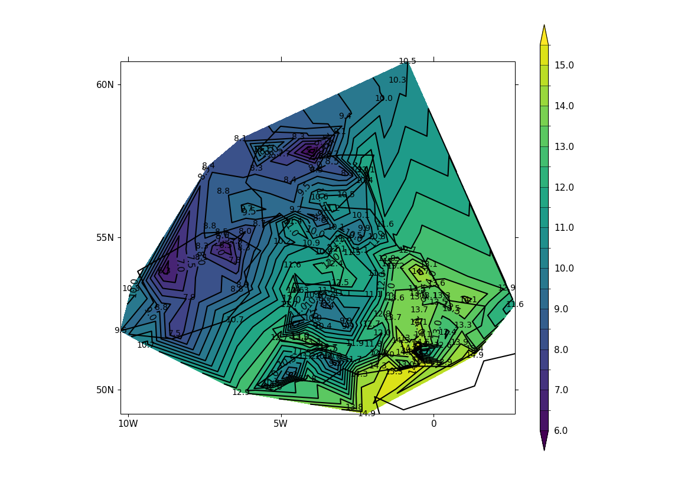

.. _example26b:

Example 26b
***********

.. code-block:: python
   :caption: *TODO describe Example 26b*

   # Arrays for data
   lons=[]
   lats=[]
   pressure=[]
   temp=[]

   # Read data and make the contour plot
   f = open('cfplot_data/synop_data.txt')
   lines = f.readlines()
   for line in lines:
       mysplit=line.split()
       lons=np.append(lons, float(mysplit[1]))
       lats=np.append(lats, float(mysplit[2]))
       pressure=np.append(pressure, float(mysplit[3]))
       temp=np.append(temp, float(mysplit[4]))

   cfp.gopen()
   cfp.con(
       x=lons, y=lats, f=temp, ptype=1, colorbar_orientation='vertical')
   for i in np.arange(len(lines)):
       cfp.plotvars.mymap.text(
           float(lons[i]), float(lats[i]), str(temp[i]),
           horizontalalignment='center',verticalalignment='center',
           transform=ccrs.PlateCarree()
       )

   cfp.gclose()

