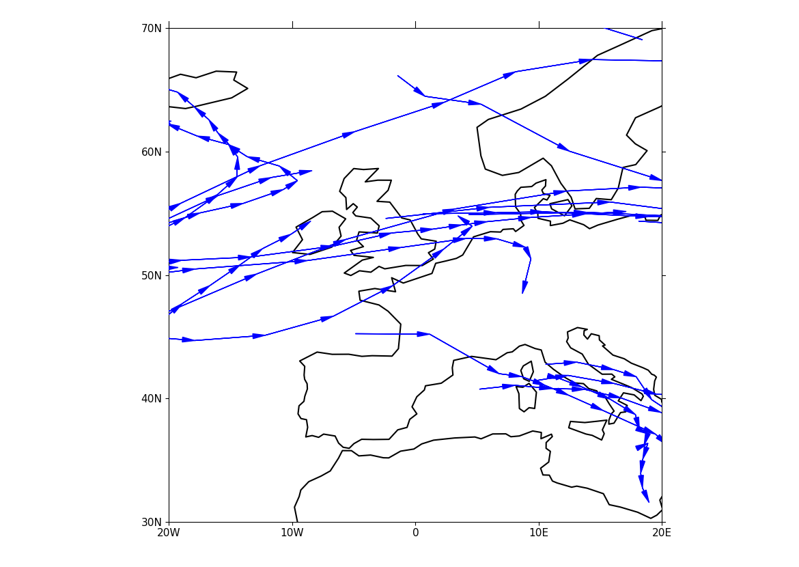

.. _example41:

Example 41
----------

.. code-block:: python
   :caption: *TODO describe Example 41*

   f = cf.read(f"{self.data_dir}/ff_trs_pos.nc")[0]

   cfp.mapset(lonmin=-20, lonmax=20, latmin=30, latmax=70)

   cfp.traj(f, vector=True, markersize=0.0, fc="b", ec="b")

