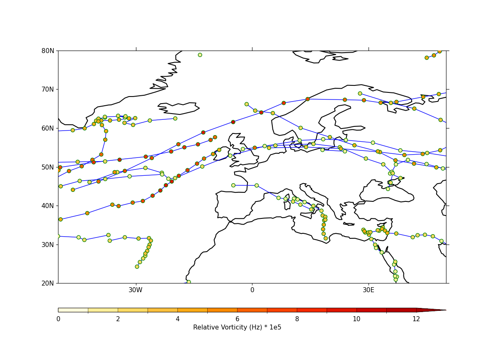

.. _example42a:

Example 42a: Tracks with labelled data points
---------------------------------------------

.. code-block:: python
   :caption: Plotting tracks with labelling of the discrete data
             points forming the trajectory shown
             with intensity matched to a displayed colour scale using
             the `legend` keyword

   f = cf.read(f"{self.data_dir}/ff_trs_pos.nc")[0]

   cfp.mapset(lonmin=-50, lonmax=50, latmin=20, latmax=80)
   g = f.subspace(time=cf.wi(cf.dt("1979-12-01"), cf.dt("1979-12-10")))
   g = g * 1e5
   cfp.levs(0, 12, 1, extend="max")
   cfp.cscale("scale1", below=0, above=13)

   cfp.traj(
       g,
       legend=True,
       linewidth=2,
       colorbar_title="Relative Vorticity (Hz) * 1e5",
   )

